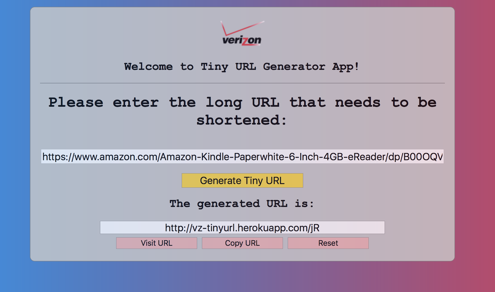

# Tiny URL Generator App: URL shortening web app similar to https://tinyurl.com

Technologies used include React/Redux, HTML5/CSS3, Node.js, Express, Sequelize/PostgreSQL.

[See this app live!](https://vz-tinyurl.herokuapp.com)

# Sample RESTful API Endpoints

## GET: https://vz-tinyurl.herokuapp.com/api/urls

### Sample Input:
N/A

### Sample Output:
      [
          {
              "id": 1,
              "longUrl": "https://www.amazon.com/Amazon-Kindle-Paperwhite-6-Inch-4GB-eReader/dp/B00OQVZDJM/ref=sr_1_1?ie=UTF8&qid=1529624251&sr=8-1&keywords=kindle",
              "shortUrl": "http://vz-tinyurl.herokuapp.com/jR"
          },
          {
              "id": 2,
              "longUrl": "https://support.google.com/chrome_webstore/answer/1053346?hl=en&ref_topic=6238977",
              "shortUrl": "http://vz-tinyurl.herokuapp.com/k5"
          },
          {
              "id": 3,
              "longUrl": "http://bleacherreport.com/articles/2782290-lionel-messi-argentinas-world-cup-hopes-in-tatters-after-loss-vs-croatia?utm_source=cnn.com&utm_medium=referral&utm_campaign=editorial",
              "shortUrl": "http://vz-tinyurl.herokuapp.com/l5"
          },
          {
              "id": 4,
              "longUrl": "https://www.ebay.com/itm/DJI-Mavic-Pro-DJI-Mavic-Propeller-Guard-64GB-Card-Card-Hardcase-Cloth/182859584378?epid=694659840&hash=item2a9347d37a:g:OJAAAOSwAHBaRnwj",
              "shortUrl": "http://vz-tinyurl.herokuapp.com/mO"
          }
      ]

---

## GET: https://vz-tinyurl.herokuapp.com/api/urls/1

### Sample Input
N/A

### Sample Output:
      {
          "id": 1,
          "longUrl": "https://www.amazon.com/Amazon-Kindle-Paperwhite-6-Inch-4GB-eReader/dp/B00OQVZDJM/ref=sr_1_1?ie=UTF8&qid=1529624251&sr=8-1&keywords=kindle",
          "shortUrl": "http://vz-tinyurl.herokuapp.com/jR"
      }

---

## DELETE: https://vz-tinyurl.herokuapp.com/api/urls/3

### Sample Input:
N/A

### Sample Output:
      {
          "deletedRows": 1
      }

---

## POST: https://vz-tinyurl.herokuapp.com/api/urls

### Sample Input (provided in the request body):
      {
          "longUrl": "https://www.amazon.com/Amazon-Kindle-Paperwhite-6-Inch-4GB-eReader/dp/B00OQVZDJM/ref=sr_1_1?ie=UTF8&qid=1529624251&sr=8-1&keywords=kindle"
      }

NOTE: POST will first attempt to return any matching record in case it was already added before, otherwise it will just create the record from scratch.

### Sample Output:
      {
          "id": 1,
          "longUrl": "https://www.amazon.com/Amazon-Kindle-Paperwhite-6-Inch-4GB-eReader/dp/B00OQVZDJM/ref=sr_1_1?ie=UTF8&qid=1529624251&sr=8-1&keywords=kindle",
          "shortUrl": "http://vz-tinyurl.herokuapp.com/jR",
          "wasAdded": true
      }

---

## PUT: https://vz-tinyurl.herokuapp.com/api/urls/4

### Sample Input (URL ID needs to be supplied as a request parameter. Any URL ID supplied in the body is just ignored)
      {
          "longUrl": "https://www.ebay.com/itm/DJI-Mavic-Pro-DJI-Mavic-Propeller-Guard-64GB-Card-Card-Hardcase-Cloth/182859584378?epid=694659840&hash=item2a9347d37a:g:OJAAAOSwAHBaRnwj",
          "shortUrl": "http://vz-tinyurl.herokuapp.com/MYNEWURL"
      }

### Sample Output:
      {
          "affectedRows": {
              "id": 4,
              "longUrl": "https://www.ebay.com/itm/DJI-Mavic-Pro-DJI-Mavic-Propeller-Guard-64GB-Card-Card-Hardcase-Cloth/182859584378?epid=694659840&hash=item2a9347d37a:g:OJAAAOSwAHBaRnwj",
              "shortUrl": "MYNEWURL",
              "createdAt": "2018-06-22T05:05:29.808Z",
              "updatedAt": "2018-06-22T05:11:11.182Z"
          }
      }

